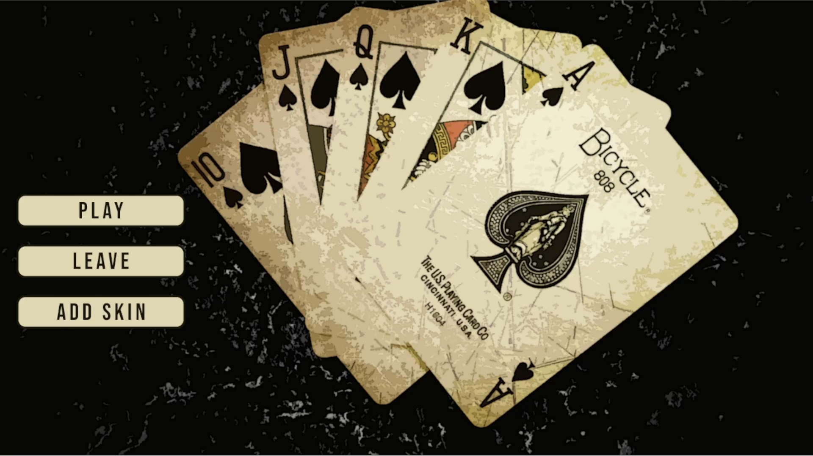
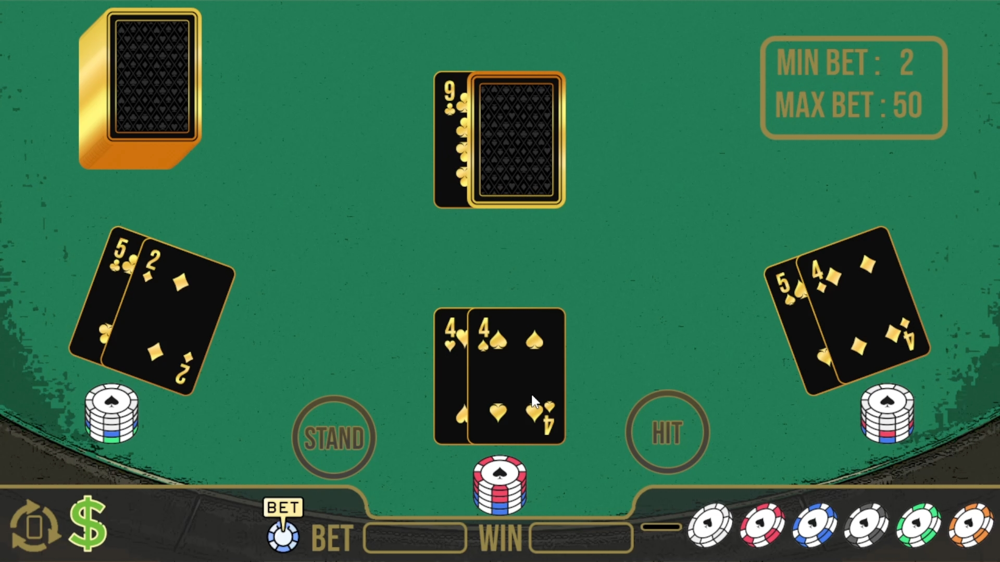
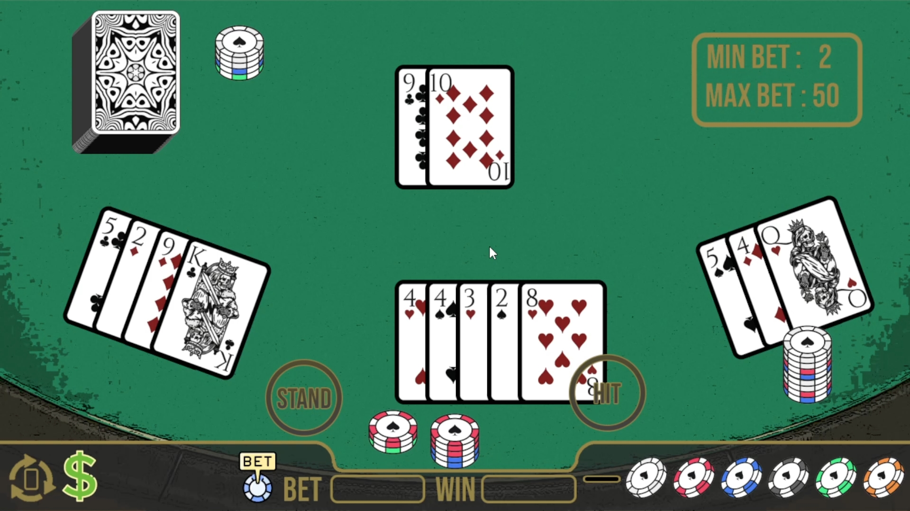

# Blackjack

Blackjack is my own implementation of card game Blackjack made with C++ and SDL2. This project was a test task and built within 14 days. Not finished yet
***

## Project Overview
This project is a Blackjack game that faithfully implements the core rules of the classic card game while offering some additional features, such as the ability to change card skins at runtime. Both the game and its engine were developed entirely from scratch, covering essential gameplay mechanics, game logic, and foundational components.

The project served as a platform for experimenting with game development concepts, so some experimental features and custom code structures are in place. While the UI has some planned elements that couldn't be completed within the timeline, the game itself is functional and enjoyable. Development took approximately 120 hours over two weeks, with most of the time dedicated to the foundational engine and essential gameplay.

## Getting Started
<ins>**1. Downloading the repository:**</ins>

Start by cloning the repository with `git clone --recursive https://github.com/SkaLe3/Blackjack`.
If the repository was cloned non-recursively previously, use `git submodule update --init` to clone the necessary submodules.

<ins>**2. Configuring the dependencies:**</ins>

Run the [Win-GenProjects.bat](httpps://github.com/SkaLe3/Blackjack/blob/master/Scripts/Win-GenProjects.bat) file found in `Scripts` folder.
This will generate a Visual Studio solution file.

If changes are made, or if you want to regenerate project files, rerun the [Win-GenProjects.bat](httpps://github.com/SkaLe3/Blackjack/blob/master/Scripts/Win-GenProjects.bat) script file found in `Scripts` folder.

### Requirements
- [Visual Studio 2022](https://visualstudio.com) (required to automatically set up the project, otherwise you will have to set up the project yourself)

## Showcase

## License
Blackjack is licensed under the Apache-2.0 License. See the [LICENSE](https://github.com/SkaLe3/Blackjack/blob/main/LICENSE) file for more details.
